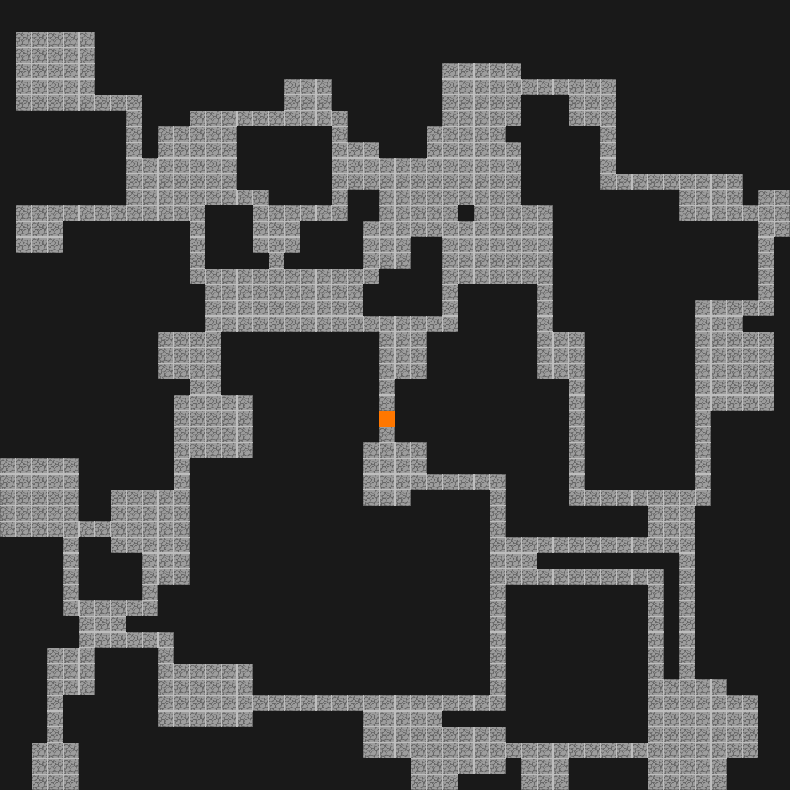
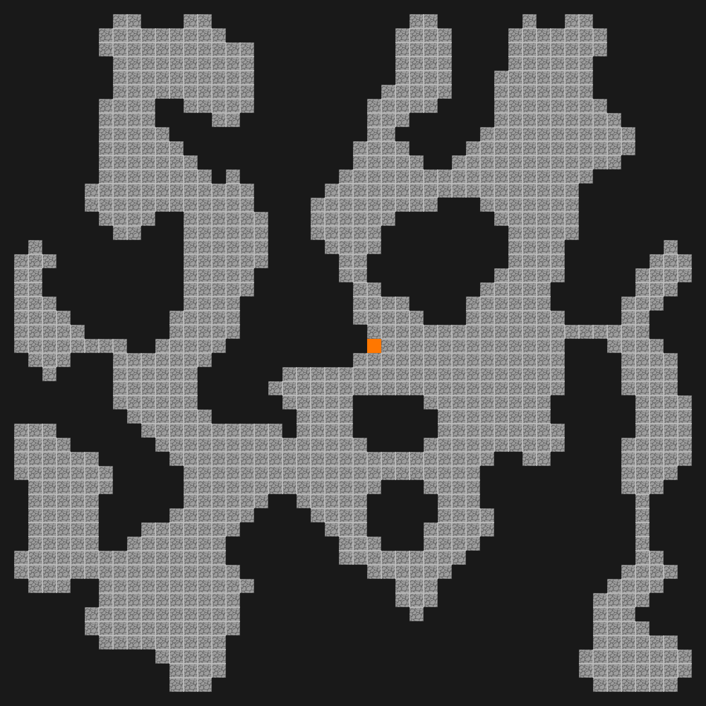

# RPG Tools
Simple RPG helper tools for generating content for tabletop role-playing games
(or any other game that uses maps).

Currently `rpgmap` is the only available tool but more are planned:

* Non-player character (NPC) generator
* Town generator
* World-map generator
* ... (ideas welcome)

## RPG Map
`rpgmap` is a grid-based map generator. This is the primary tool available
right now.

Example maps look like this:

```
rpgmap -x 50 -y 50 --num-rooms 50 --room-size 7
```


```
rpgmap -s cave -x 50 -y 50
```


The two primary room types are `halls` (default) and `cave`. Halls represt a
classical rogue-like dungeon; rooms are rectangular and placed randomly on a
grid and then connected by single-width hallways. No effort is made to ensure
that the rooms overlap, which creates interesting non-rectangular rooms when
they overlap.

Caves are organic-looking blobs that are created by filling the grid with
random cells and then annealing using a cellular automata mechanism. This
creates blobs that vaguely resemble water-carved caves. The cellular automata
strategy can produce blobs that are not connected, when this occurs, they're
removed (if too small) or connected via a hallway.

Maps have an orange square that appears near the middle, which is intended to
be the entrance.

Note on aesthetics: I am not a capable artist and the maps are kind of ugly. To
be improved in the future.

# Install
Make sure that you have the Rust compiler and cargo installed.
```
cargo build --release
./target/release/rpgmap --help
```

# Usage
For argument descriptions:
```
$ rpgmap --help
A simple map generator for role playing games

Usage: rpgmap [OPTIONS]

Options:
  -x, --width <INT>        The horizontal width of the map [default: 50]
  -y, --height <INT>       The vertical height of the map [default: 50]
  -s, --style <map-style>  The style of map to generate [default: halls] [possible values: halls, cave]
  -S, --scale <INT>        The number of pixels for each square [default: 25]
  -o, --output <NAME>      The name of the output file [default: rpgmap.png]
      --num-rooms <INT>    The number of rooms to generate [default: 30]
      --room-size <INT>    The size of generated rooms [default: 10]
  -h, --help               Print help
  -V, --version            Print version
```
