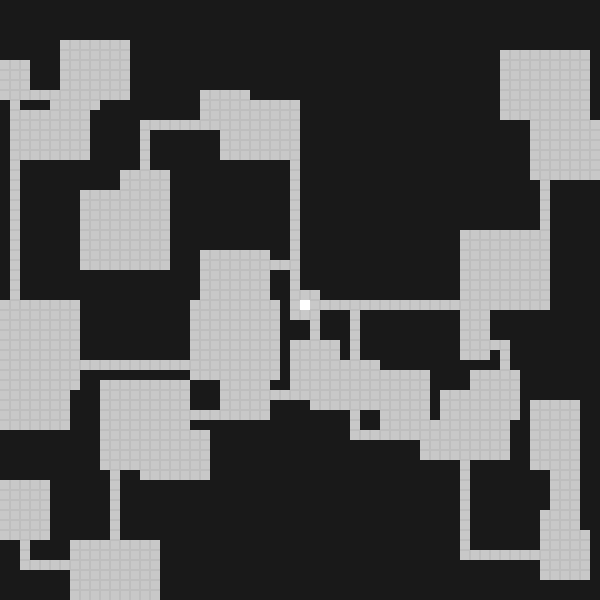

# RPG Tools
Simple RPG helper tools for generating content for tabletop role-playing games. Currently `rpgmap` is the only available tool but more are planned:

* Non-player character (NPC) generator
* Town generator
* World-map generator
* ... (ideas welcome)

This program currently has 2 implementations: a primary one in Rust and a secondary one in Python. Initially, this was an implementation test to compare speed and code size. This is slowly going to migrate into an implementation in Rust and a Python wrapper library.

## RPG Map
`rpgmap` is a grid-based map generator. This is the primary tool available right now.

Example maps look like this:



# Install
## Rust
Make sure that you have the Rust compiler and cargo installed.
```
cargo build --release
./target/release/rpgmap --help
```

## Python
Make sure that you have Python3 installed on your system.
```
cd python
pip3 install --user .
```

# Usage
For argument descriptions:
```
rpgmap --help
```

Simple example:
```
rpgmap -x 200 -y 200 example.png
```
